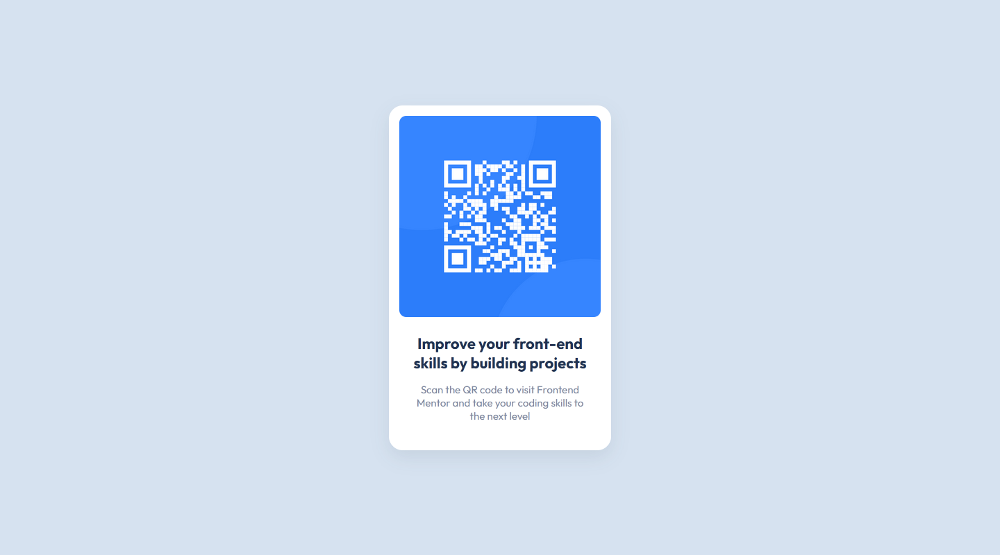

# Frontend Mentor - QR code component solution

This is a solution to the [QR code component challenge on Frontend Mentor](https://www.frontendmentor.io/challenges/qr-code-component-iux_sIO_H). Frontend Mentor challenges help you improve your coding skills by building realistic projects. 

## Table of contents

- [Overview](#overview)
  - [Screenshot](#screenshot)
  - [Links](#links)
- [My process](#my-process)
  - [Built with](#built-with)
  - [What I learned](#what-i-learned)
- [Author](#author)

## Overview

### Screenshot

### Links

- Solution URL: [Github](https://github.com/Absynthee/qr-code-component-main)
- Live Site URL: [Github Pages](https://absynthee.github.io/qr-code-component-main/)

## My process

### Built with

- Semantic HTML5 markup
- CSS custom properties
- Flexbox

### What I learned

As this was quite a simple challenge and I typically spend quite a lot of time getting everything right or as close to perfect as possible, this time I challenged myself to be quick. I was able to complete this challenge in 20 minutes.

## Author

- Website - [Austin Spillman](https://www.austinspillman.com)
- Frontend Mentor - [@Absynthee](https://www.frontendmentor.io/profile/Absynthee)
